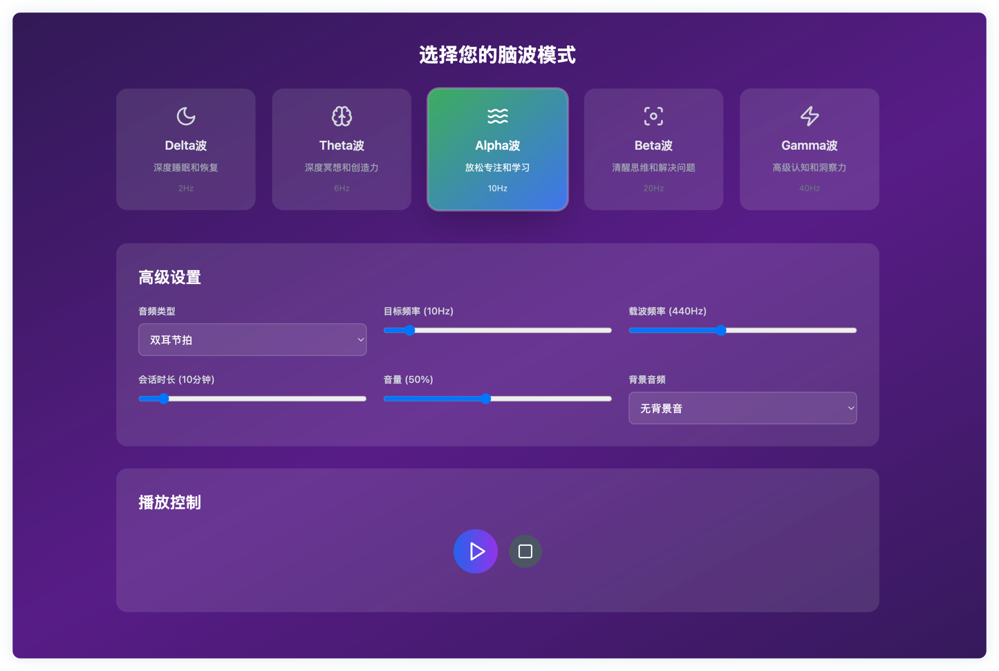

# Brainwave Music App

A brainwave-inspired music web app that helps you stay focused while you work. Built with React, TypeScript, and Vite, styled with Tailwind CSS, and powered by modern UI primitives.

## Screenshot (Still buggy)



## Features

- Focus-enhancing soundscapes and playlists
- Clean, responsive UI with dark mode
- Keyboard-friendly controls and accessible components
- Fast startup and hot reload via Vite

## Tech Stack

- React 18 + TypeScript
- Vite 6
- Tailwind CSS 3
- Radix UI primitives and utilities (e.g., Dialog, Tabs, Slider)
- Additional libs: lucide-react, react-hook-form, zod, recharts

## Getting Started

Prerequisites: Node 18+ and pnpm installed.

1. Install dependencies

```bash
pnpm install
```

2. Start the dev server

```bash
pnpm dev
```

3. Open the app

Visit http://localhost:5173 (default Vite port) after the dev server starts.


## License

This project is licensed under the MIT License. See `LICENSE` if provided, or adapt as needed.

---

Made with focus and flow.
